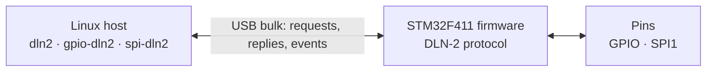

# f411_dln2_gpio - DLN-2 emulator for STM32F411

Firmware for the STM32F411 (WeAct Black Pill) that emulates a Diolan DLN-2 USB
adapter (`a257:2013`). The Linux in-tree `dln2` drivers expose the board's pins
as a GPIO chip and an SPI bus, accessible with libgpiod and spidev.

## Features

- **Host driver** — in-tree `dln2`, `gpio-dln2`, `spi-dln2` (kernel 3.19+)
- **GPIO** — 17 lines: direction, read/write, output level kept after line release
- **GPIO events** — edge events for `gpiomon`, on-device debounce (libgpiod v2 `--debounce`)
- **SPI master** — 4 chip selects, 8/16-bit frames, modes 0–3, 375 kHz – 48 MHz
- **Fault handling** — request processing outside the USB IRQ, 0.5 s watchdog, state reset on USB re-enumeration

## Prerequisites

| Tool | Version | Purpose |
|------|---------|---------|
| [STM32CubeMX](https://www.st.com/en/development-tools/stm32cubemx.html) | >= 6.17 | Regenerate HAL/USB code from `.ioc` |
| [STM32CubeIDE](https://www.st.com/en/development-tools/stm32cubeide.html) | >= 2.1 | Build, flash, debug |
| STM32Cube FW_F4 | 1.28.3 | HAL + USB device library |
| SWD programmer or USB DFU | — | Flashing |
| Linux | >= 3.19 | `dln2` kernel drivers |
| [libgpiod](https://git.kernel.org/pub/scm/libs/libgpiod/libgpiod.git/) | v1 or v2 | `gpiodetect`, `gpioset`, `gpioget`, `gpiomon` |

## Quick Start

```bash
# 1. Generate the CubeMX tree (Drivers/, Middlewares/, startup and linker
#    scripts are .gitignored): open f411_dln2_gpio.ioc in STM32CubeMX -> GENERATE CODE

# 2. Build and flash

# 3. Plug the board's USB-C into a Linux host
lsusb | grep a257            # a257:2013 Diolan DLN-2
gpiodetect                   # gpiochipN [dln2] (17 lines)
gpioset gpiochipN 0=0        # LED on (PC13 is active-low)
gpioset gpiochipN 0=1        # LED off
gpioget gpiochipN 1          # read PB0
gpiomon -r gpiochipN 1       # rising edges on PB0
```

## Pinout

| Function | Pin | Board label | Notes |
|----------|-----|-------------|-------|
| GPIO line 0 | PC13 | `C13` | Onboard LED, active-low |
| GPIO lines 1–16 | PB0–PB15 | `B0`–`B15` | Inputs start with pull-up; line 12 (PB11) is not bonded on this package |
| SPI CS0–CS3 | PA4, PA8, PA9, PA10 | `A4`, `A8`, `A9`, `A10` | Active low |
| SPI SCK / MISO / MOSI | PA5 / PA6 / PA7 | `A5` / `A6` / `A7` | SPI1 |
| SWDIO / SWCLK | PA13 / PA14 | 4-pin SWD header | Flashing, debug |
| USB | PA11 / PA12 | USB-C | Full speed |

## SPI

The kernel's `dln2-spi` driver registers the bus as `spiN`. A USB adapter
can't describe what is wired to it, so a device on the bus has to be created
from the host. `host/dln2_adxl345/` does this for an ADXL345 (mode 3, 1 MHz)
and binds it to spidev:

```bash
make -C host/dln2_adxl345                           # needs kernel headers, gcc, make
modprobe spidev
insmod host/dln2_adxl345/dln2_adxl345.ko            # params: cs=0..3, speed_hz
python3 host/adxl345_read.py /dev/spidevN.0         # DEVID 0xE5, x/y/z in g
python3 host/adxl345_live.py /dev/spidevN.0         # live plot at http://<host>:8000/
```

Throughput is bounded by USB full speed: about 200 KB/s at 6 MHz, with a
round trip of about 0.12 ms for small transfers.

## How it works



The USB interrupt only assembles request messages. The main loop handles one
request at a time, sends the reply, then accepts the next request. The same
loop samples the GPIO lines and queues edge events, which go out between
replies. There is no EXTI, because PC13 and PB13 share EXTI line 13.

## Limitations

- Pulses shorter than one main-loop pass can be missed. During long, slow SPI
  transfers a pass can take a few ms.
- When watching both edges, the kernel reads the line again to label each
  event, so very fast changes may be mislabelled. `-r` / `-f` are exact.
- Debounce is one period shared by all lines and applies to events only.
- Pull resistors can't be configured: the DLN-2 protocol has no command for it.

## Status

The kernel also registers `dln2-i2c` and `dln2-adc`. The firmware rejects
their commands, so both fail to probe (`error -121` in `dmesg`). GPIO and SPI
are unaffected.

| Function | Status | Plan |
|----------|--------|------|
| GPIO | Done | — |
| SPI | Done | — |
| I2C | Deferred until a test device is available | I2C1 on PB6/PB7 (lines 7/8 become busy), fixed 100 kHz |
| ADC | To be decided | Candidate: 4 channels on PA0–PA3 (PA0 is the KEY button) |
| UART | Not possible | The kernel's `dln2` driver has no UART function |

## Project Structure

```
f411_dln2_gpio/
├── Core/                        # CubeMX-generated; main loop + watchdog in USER CODE
├── USB_DEVICE/App/
│   ├── usb_device.c             # CubeMX; PostTreatment hook swaps in the DLN-2 class
│   ├── usbd_dln2.c/.h           # DLN-2 protocol: GPIO, events, SPI
│   └── usbd_dln2_desc.c/.h      # a257:2013 descriptors and strings
├── host/
│   ├── dln2_adxl345/            # Linux module: ADXL345 spidev on the DLN-2 SPI bus
│   ├── adxl345_read.py          # Read the ADXL345 through spidev
│   └── adxl345_live.py          # Live accelerometer plot in the browser
└── f411_dln2_gpio.ioc           # CubeMX config — source of truth
```

## License

MIT. CubeMX-generated STM32 HAL and USB library code keeps its own ST license terms.
